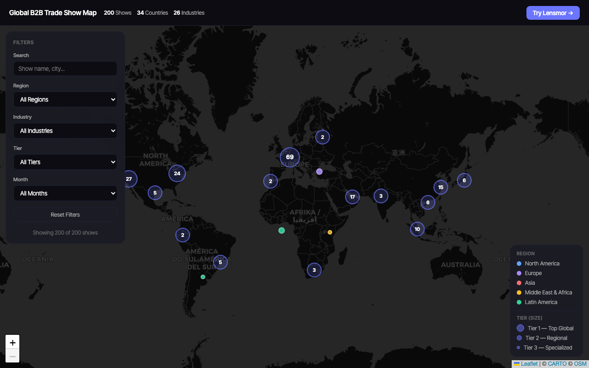

# Global B2B Trade Show Map

[](https://lensmorofficial.github.io/trade-show-world-map/)
[](https://github.com/LensmorOfficial/trade-show-world-map/stargazers)
[](https://creativecommons.org/licenses/by/4.0/)
[](https://github.com/LensmorOfficial/trade-show-world-map/commits/main)

**[Open Interactive Map →](https://lensmorofficial.github.io/trade-show-world-map/)** — works entirely in browser, no install needed.

> If this map saves you time, a star helps others find it.

An interactive world map of **200+ verified B2B trade shows** across 60+ countries — filterable by industry, region, tier, and month. Built for sales and marketing teams who need a fast visual answer to "which shows should we be at this year?"

## Preview

[](https://lensmorofficial.github.io/trade-show-world-map/)

Click any pin to see show details — name, dates, venue, exhibitor count, and a direct link to the official website.

## What You Can Do

- **Find shows by industry** — filter to medical devices, packaging, food & beverage, automotive, and 18 more categories
- **Explore by region** — zoom into Europe, North America, Asia, MENA, or Latin America
- **Filter by month** — see what's coming up in Q2, Q3, or any window you care about
- **Compare tiers** — toggle between Tier 1 global flagships, Tier 2 regional leaders, and Tier 3 niche shows
- **Click through to official sites** — every pin links directly to the show's homepage
- **Use the data** — download or fetch the JSON dataset for your own analysis or integrations — see [docs/API.md](docs/API.md) for schema, code examples, and attribution requirements

## Features

- Interactive world map powered by Leaflet.js with dark CartoDB tiles
- 200+ verified B2B trade shows with venues, dates, and official websites
- Filter by region, industry, tier, month, and keyword search
- 3-tier system — Tier 1 (top global), Tier 2 (regional leaders), Tier 3 (specialized)
- Marker clustering for clean visualization at any zoom level
- Works entirely in-browser — no backend, no login required

## Data Schema

Each show entry includes:

| Field | Description |
|-------|-------------|
| `name` | Official show name |
| `website` | Official website URL |
| `city` / `country` | Location |
| `venue` | Exhibition hall / convention center |
| `start_date` / `end_date` | Event dates (ISO 8601) |
| `frequency` | Annual / Biennial / Triennial |
| `industry` | Industry category |
| `region` | North America / Europe / Asia / Middle East & Africa / Latin America |
| `tier` | 1 = Top Global, 2 = Regional Leader, 3 = Specialized |
| `lat` / `lng` | Coordinates for map plotting |

## Industries Covered

Technology & Electronics · Healthcare & Medical · Manufacturing & Industrial · Food & Beverage · Automotive · Energy & Environment · Logistics & Supply Chain · Finance & Fintech · Retail · Construction & Building Materials · Packaging · Pharmaceutical · Aerospace & Defense · Beauty & Personal Care · Fashion & Textiles · Real Estate · Agriculture · Travel & Tourism · Marketing & Advertising · Cybersecurity · Defense · Education

## Geographic Coverage

| Region | Shows |
|--------|-------|
| Europe | ~72 |
| North America | ~53 |
| Asia | ~38 |
| Middle East & Africa | ~22 |
| Latin America | ~15 |

## Local Development

```bash
# Clone the repo
git clone https://github.com/LensmorOfficial/trade-show-world-map.git
cd trade-show-world-map

# Serve locally (required for fetch() to work)
python3 -m http.server 8000
# then open http://localhost:8000
```

## Changelog

| Date | Update |
|------|--------|
| 2026-03 | Initial release — 200 shows across 60+ countries, 22 industries |
| 2026-03 | Added interactive map with tier filtering and marker clustering |

## Contributing

Know a major show that's missing? Found an incorrect date or venue? Contributions welcome.

The fastest way to contribute: open an issue with the show name, dates, location, and official website URL — we'll add it within a few days. Or submit a PR directly if you're comfortable with JSON.

See [CONTRIBUTING.md](CONTRIBUTING.md) for the data format spec and PR checklist.

## License

Data is licensed under [CC BY 4.0](https://creativecommons.org/licenses/by/4.0/). Code is MIT.

---

## Related Projects

| Repo | Description |
|------|-------------|
| [awesome-trade-shows](https://github.com/LensmorOfficial/awesome-trade-shows) | Curated list of 200+ trade shows by industry |
| [trade-show-calendar](https://github.com/LensmorOfficial/trade-show-calendar) | Open dataset of 133+ global shows in CSV/JSON + interactive timeline |
| [event-tech-landscape](https://github.com/LensmorOfficial/event-tech-landscape) | Map of 80+ tools powering the event industry |
| [exhibitor-intelligence-playbook](https://github.com/LensmorOfficial/exhibitor-intelligence-playbook) | 6-chapter B2B trade show ROI playbook |
| [trade-show-email-templates](https://github.com/LensmorOfficial/trade-show-email-templates) | 16 ready-to-use email templates for trade show outreach |
| [trade-show-skills](https://github.com/LensmorOfficial/trade-show-skills) | Claude Code AI skills for trade show research and planning |
| [trade-show-tools](https://github.com/LensmorOfficial/trade-show-tools) | Free browser-based tools: ROI calculator, budget planner, and more |

---

## About Lensmor

This map is built and maintained by [Lensmor](https://www.lensmor.com/?utm_source=github&utm_medium=readme&utm_campaign=trade-show-world-map) — an AI-native event intelligence platform for B2B sales and marketing teams.

Lensmor goes beyond the map: analyze exhibitor lists, surface hidden competitors, and generate qualified leads from trade shows before the event starts.

- [How to capture exhibitor leads at trade shows](https://www.lensmor.com/blog/trade-show-lead-capture?utm_source=github&utm_medium=readme&utm_campaign=trade-show-world-map)
- [How to collect leads at trade shows](https://www.lensmor.com/blog/how-to-collect-leads?utm_source=github&utm_medium=readme&utm_campaign=trade-show-world-map)

**[Try Lensmor Free →](https://www.lensmor.com/?utm_source=github&utm_medium=readme&utm_campaign=trade-show-world-map)**

---

Found the map useful? A star takes 2 seconds and helps other B2B teams discover this resource.

[](https://github.com/LensmorOfficial/trade-show-world-map)
